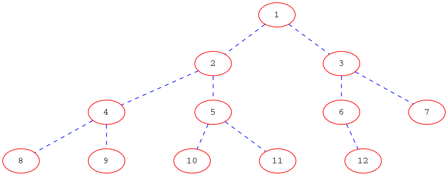

**Zadatak** Potrebno je implementirati  (maksimalnu) hrpu unutar predloška
klase `MaxHeap`  koji je dan u datoteci
`binHeap.h`. Klasa ima predodređeni konstruktor koji kreira praznu  hrpu i
parametrizirani konstruktor koji kreira hrpu iz zadanog raspona iteratora.        

Treba implementirati sljedeće metode:
- push() - gurni element u hrpu
- pop() - ukloni maksimalni element iz hrpe
- top() - vrati maksimalni element iz hrpe
- empty() - ispitaj je li hrpa prazna
- size() - vrtai broj elemenata u hrpi
- sort() - implementacija heapsort algoritma.

Metoda `sort()` je posebna jer sortirane vrijednosti upisuje u vektor koji dobije
kao argument poziva i nakon sortiranja klasa `MaxHeap` ostaje prazna.

Klasa `MaxHeap` koristi `std::vector` za spremanje podataka.

**Hrpa** (_heap_) je binarno stablo sa sljedećim svojstvima:

- Stablo je potpuno što znači da su sve razine stabla popunjene, osim eventualno
najniže koja ima elemente pozicionirano lijevo;
- Stablo zadovoljava sljedeći uređaj: podatak u svakom čvoru  veći je ili jednak od podataka
spremljenih u njegovu djecu.

Takva se hrpa još naziva i *maksimalna hrpa* (_maxheap_); ako u drugom svojstvu veće ili jednako zamijenimo
s manje ili jednako dobivamo *minimalnu hrpu* (_minheap_).

Ovdje je dan jedan primjer minimalne hrpe.

Osnovno strukturalno svojstvo hrpe je da može "linearizirati", odnosno zapamtiti
kao polje. Na primjer,

se može zapamtiti kao

Vidimo da čvor s indeksom k ima svoju djecu na pozicijama 2k (lijevo dijete) i 2k+1 (desno dijete).
To vrijedi ako čvorove indeksiramo od jedan, tako da korijenski čvor ima indeks 1. Ako čvorove indeksiramo
od nule, onda k-ti čvor ima djecu na pozicijama 2k+1 i 2k+2.

**Izbacivanje korijenskog elementa iz stabla**. Ovu operaciju radi funkcija
`pop()`. Ideja je slijedeća: korijenski element zamijenjujemo s posljednjim
 elementom. Kako je sada korijenski element na zadnjem mjestu jednostavno ga
možemo izbaciti iz spremnika. Ako je premnik `std::vector` treba iskoristiti
`pop_back()` metodu. Ostatak spremnika nije u dobrom poretku da bi bio hrpa,
ali oba glavna podstabla jesu u dobrom poretku.Da bismo vratili dobar poredak
vršimo sljedeću operaciju:

- Uspoređujemo korijenski element sa njegovom djecom. Ako je veći ili jednak od
 svoje djece poredak je dobar i gotovi smo. Ako je manji od barem jednog svog
 djeteta uzimamo veće dijete i zamijenjijemo korijenski element s njim.

Nakon ove operacije samo je podstablo u kojem je bivši korijenski element
eventualno u krivom poretku. Stoga se identična procedura nastavlja na tom
podstablu.

Kako to funkcionira na gornjem primjeru može se vidjeti [ovdje](doc/metoda_pop.md).

**Ubacivanje novog elementa u stablo**. Novi element se ubacuje na kraj vektora,
odnosno na zadnje mjesto u pridruženom binarnom stablu. Nakon toga kreće
premještanje ubačenog elementa kako bi se postigao ispravan poredak elemenata.
Operacija je vrlo jednostavna: ubačeni element se usporedi sa svojim elementom
roditeljem i ako je veći od njega  izvrši se zamjena  elemenata. Postupak se
nastavlja dok ne dobijemo ispravan poredak što znači sve dok ubačeni element
ne bude manji ili jednak od svog roditelja ili ne dođe u korijensku poziciju.

Kako to funkcionira na gornjem primjeru može se vidjeti [ovdje](doc/metoda_push.md).

**Konstrukcija hrpe**. Ostaje nam pokazati kako konstruirati hrpu iz zadanog
raspona elemenata. Mogli bismo element po element ubacivati u hrpu pomoću
metode `push()` no postoji efikasniji način.

Prvo ćemo sve elemente interno kopirati u poretku u kojem su zadani i onda
ćemo krenuti mijenjati im poredak. Pri tome ćemo koristiti dio `pop()` algoritma.
Naime u `pop()` metodi imamo situaciju kada samo korijenski element (eventualno)
nije na svom mjestu dok su oba podstabla uređena. u toj situaciji zamjenama
elemenata moramo mijenjati samo jedno od ta dva podstabla. Taj algoritam možemo zvati
`correct_heap()`.

Ideja je krenuti od zadnjeg čvora koji nije list (tada niti svi ispred njega nisu
listovi) i na njemu pozvati `correct_heap()`, te s istom procedurom nastaviti po
svim prethodnim čvorovima, sve do korijena. Na svakom čvoru na kojem pozovemo
`correct_heap()` imamo ispunjen uvjet da su njegova podstabla u dobrom poretku.
To je posljedica smjera u kojem se algoritam odvija.

Kako to funkcionira na jednom primjeru može se vidjeti [ovdje](doc/konstruktor.md).

**Heapsort**. Maksimalna hrpa nam može poslužiti za sortiranje niza.
Uočimo da je najveći element uvijek na početku niza i dobivamo ga metodom `top()`.
Ako ga smjestimo u novo polje na zadnje mjesto i pozovemo metodu `pop()` dobivamo
za jedan element manju hrpu čiji je maksimalni element ponovo na početku
hrpe. Iteriranjem po svim elementima dobivamo niz u rastućem poretku dok hrpa
završava prazna.
