**Konstrukcija hrpe iz ulaznog niza**.  Neka je dan sljedeći ulazni niz:

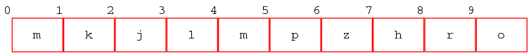

odnosno, zapisano kao potpuno binarno stablo:

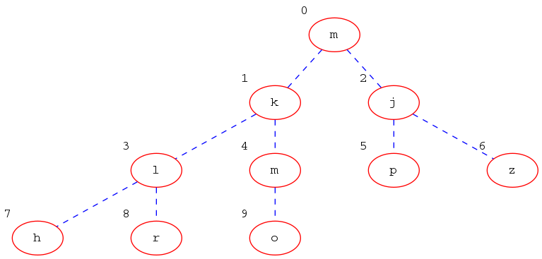

Ukupan broj elemenata je `n=10`. Zadnji element ima roditelja na mjesto
`(9-1)/2 = 4`. Procedura će sada ići po `l=4,3,2,1,0`. Za `l=4` imamo:  

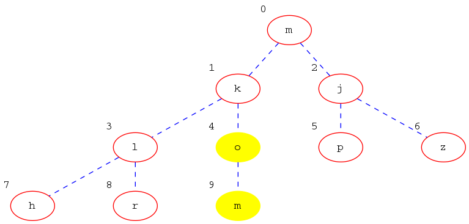

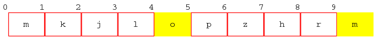

Za `l=3`:

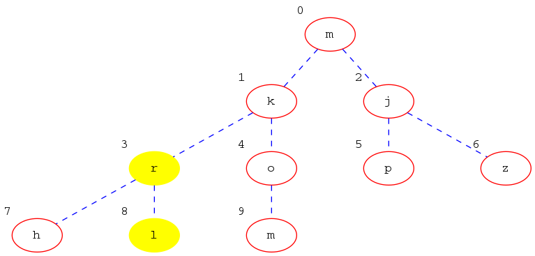

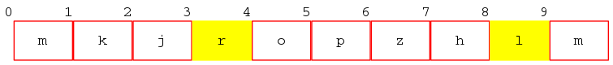

Za `l=2`:

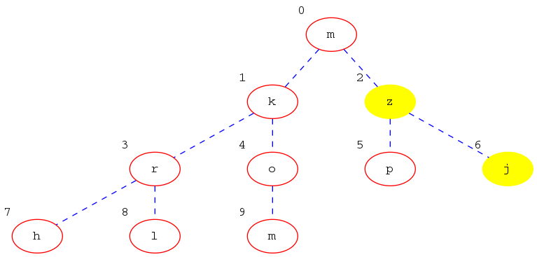

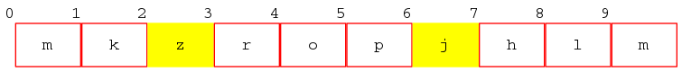

Za `l=1`:

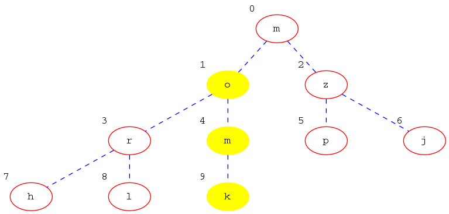

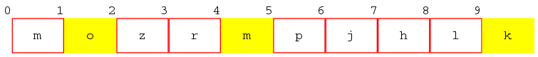

Za `l=0`:

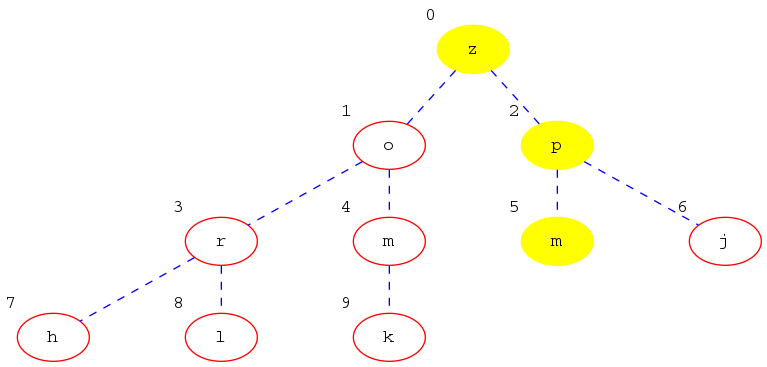

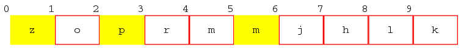
