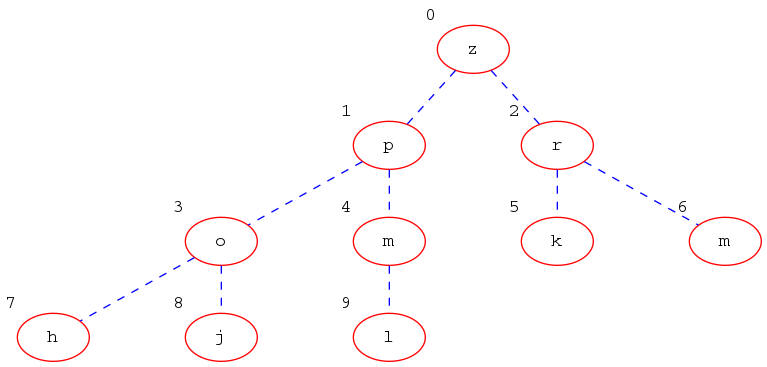
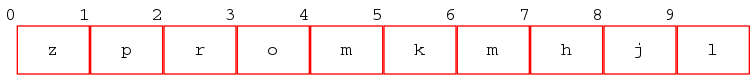
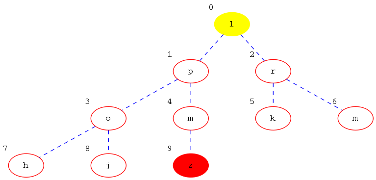
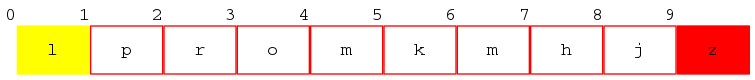
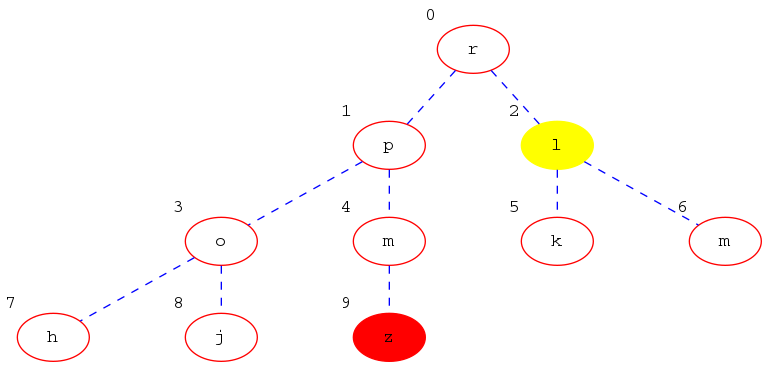
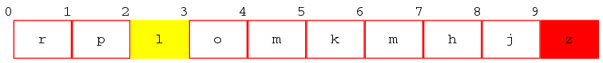
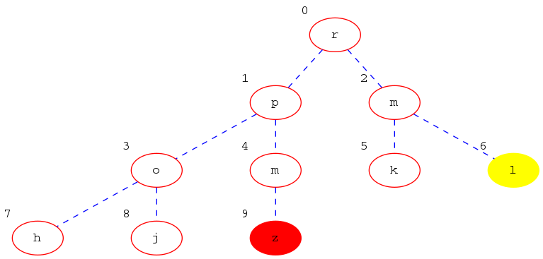
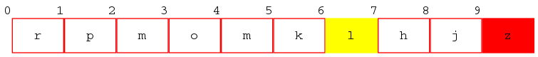
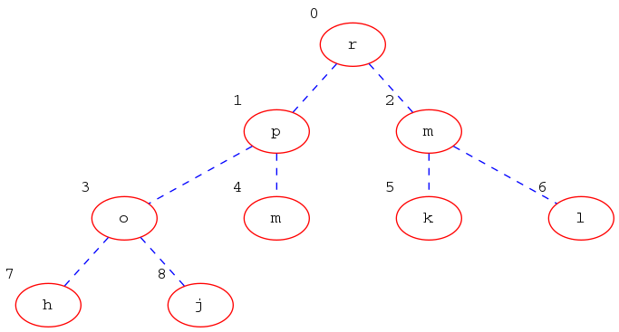
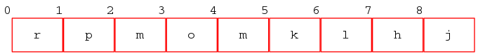

Polazno stablo je sljedeće:

odnosno

**Prvi korak**. Zamijenjujemo `z` i `l`.

**Drugi korak**.  Zamijenjujemo `l`i `r`.

**Treći korak**.  Zamijenjujemo `l`i `m`.

**Završno stablo**.

Operacija se nastavlja sve dok ne naiđemo na element koji je u dobrom
položaju (veći ili jednak od svoje djece) ili dok ne dođemo do elemeta
lista.
