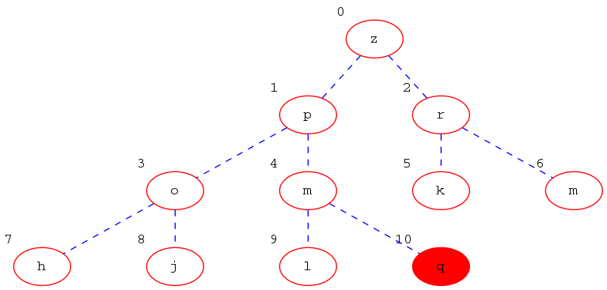
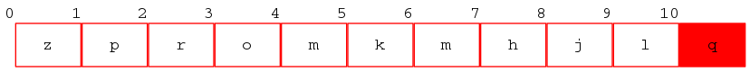
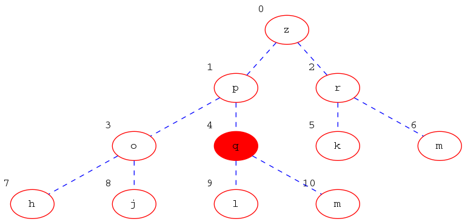
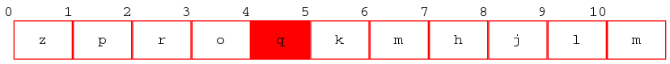
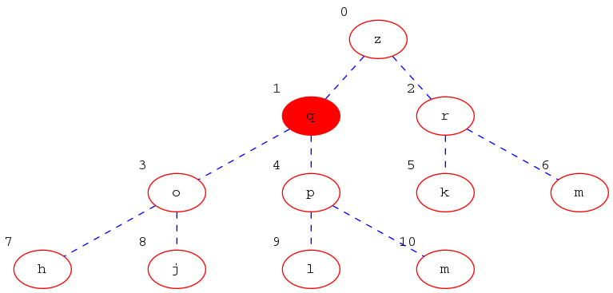
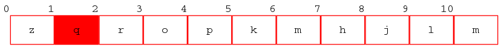
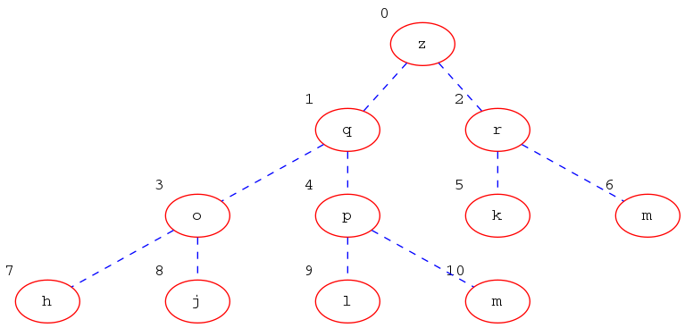
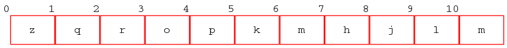

U polazno stablo prikazano ovdje

odnosno

ubacujemo element `q`.
**Prvi korak**. Novi element dolazi na zadnje mjesto:

**Drugi korak**.  Kako je `q` veći od `m` zamijenjujemo `q`i `m`.

**Treći korak**.  Kako je `q` veći i od `p` zamijenjujemo `q`i `p`.

**Završno stablo**. Sada je `q` manji od svojeg roditelja i time smo završili. 

Operacija se nastavlja sve dok ubačeni element nije dobro pozicioniran.
