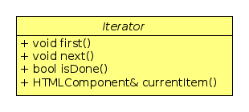

# Oblikovni obrasci _Composite_ i _Iterator_

## HTML elementi -- _Composite_

U ovo zadatku koristimo _Composite_ oblikovni obrazac kako bismo reprezentirali
HTML elemente (tagove).  Među elementima imamo jedostavne koji ne sadrže druge elemente,
na primjer `<strong>neki tekst</strong>`, te složene koji sadrže druge tagove,
kao što je `ul`:
```HTML
<ul>
  <li>item 1</li>
  <li>item 2</li>
  <li>item 3</li>
</ul>
```

Svaki jednostavni tag ima svoje **ime** i **tijelo** koji se inicijaliziraju u konstruktoru, a
sa složenim tagom dijeli zajedničke metode  prikazane ovdje u baznoj klasi `HTMLComponent`:


Funkcija `getTagName()` vraća ime elementa, recimo `li`, metoda
`getStartTag()` tada vraća `<li>`, a metoda  `getEndTag()` vraća `</li>`.
Metoda `getBody()` vraća tijelo elementa, na primjer string `item 1`.
Konačno, metoda `generateHTML()` vraća cijeli HTML element
`<li>item 1</li>`. Ime elementa možemo postaviti pomoću metode `setTagName()`,
a tijelo pomoću metode `setBody()`. 


Jednostavni element se implementira u klasi `HTMLTag`, a složeni element
u klasi `HTMLCompositeTag`. Imamo strukturu:


Klasa  `HTMLCompositeTag` ima metode za rad sa djecom koje nisu prisutne u
baznoj klasi i stoga imamo metodu `getComposite()` u baznoj klasi koju moramo
preraditi u `HTMLCompositeTag` klasi.


Klasa `HTMLTag` ima tijelo elementa dok ga klasa `HTMLCompositeTag` nema.
Umjesto tijela ona ima listu djece koja čine njeno tijelo. Kako bismo mogli
dozvoliti miješanje teksta i HTML elemenata kao u primjeru

```HTML
<p>Ovo je <strong>podebljani tekst</strong>. </p>
```
uvodimo još jedan jednostavan HTML element koji nazivamo `HTMLText`,
koji sadrži samo tekst i pri ispisu daje goli tekst. Time dobivamo strukturu


-  Tagove treba kreirati dinamički i cijela konstrukcija ne smije gubiti memoriju, što treba provjeriti pomoću
**valgrind**-a.
- U glavnom programu konstruirati nekoliko tagova (jednu web stranicu) i pozivom metode `generateHTML()`
na korijenskom elementu ispisati cijelu stranicu. Na primjer:

```C++
std::unique_ptr<HTMLCompositeTag> root{new HTMLCompositeTag("html")};
root->addComponent(new HTMLCompositeTag("body"));
auto * body = root->getComponent(0)->getComposite();
body->addComponent(new HTMLTag("p","Osobna web stranica."));
body->addComponent(new HTMLCompositeTag("ul"));
auto * ul = body->getComponent(1)->getComposite();
ul->addComponent(new HTMLTag("li", "item-1"));
ul->addComponent(new HTMLTag("li", "item-2"));
ul->addComponent(new HTMLTag("li", "item-3"));
body->addComponent(new HTMLCompositeTag("p"));
auto * p = body->getLastComponent()->getComposite(); // getLastComponent() je zgodan dodatak
p->addComponent(new HTMLText("Ovaj tekst je "));
p->addComponent(new HTMLTag("strong","pisan podebljano."));

auto html = root->generateHTML(); // ispis čitave stranice
std::cout << html;
```

Ispis će biti:
```
<html>
<body>
<p>Osobna web stranica.</p>
<ul>
<li>item-1</li>
<li>item-2</li>
<li>item-3</li>
</ul>
<p>
Ovaj tekst je <strong>pisan podebljano.</strong>
</p>
</body>
</html>
```

## _Iterator_ kroz HTML elemente

Potrebno je implementirati iterator koji iterira kroz HTML elemente. Taj Iterator
implemetira sučelje:



Konkretan iterator nazivamo `CompositeIterator`:


Funkcija koja vraća instancu `CompositeIterator` klase prisutna je u
`HTMLComponent` klasi i tamo ima implementaciju koja izbacuje izuzetak jer jednostavni elementi
ne generiraju iterator. To radi samo  `HTMLCompositeTag` element.


**Iteriranje kroz Composite**

Iteriranje kroz _Composite_ uvijek počinje na složenom elementu. Ako krećemo s jednostavnim 
elementom, onda je on ujedno i jedini element u kolekciji. 

- Iterator treba zapamtiti `begin` i `end` iteratore spremnika koji sadrži djecu elementa na kojem se 
nalazi. Oni služe za iteriranje kroz listu djece (pri tome se `begin` pomiče).

- Kada naiđe na složeni element iterator nastavlja kretanje po djeci tog elementa. Da bi znao gdje treba 
nastaviti kad se vrati na iteriranje kroz prethodni složeni element zapamtit će par iteratora  `begin` i `end`
na stogu. Nakon toga će  `begin` i `end` inicijalizirati sa `begin` i `end` iteratorima spremnika koji sadrži djecu 
trenutnog elementa i sada može nastaviti iterirati. Kada prođe kroz svu djecu inicijalizira   `begin` i `end` 
vrijednostima spremljenim na stog.

- Iteriranju je kraj kada je stog prazan i `begin` == `end`.

- Metoda `currentItem()` treba vratiti referencu na HTML komponentu kako bi se izbjeglo kopiranje i kako bi se 
HTML elementi mogli mijenjati.

- U gornjoj se shemi  ne smiju _preskakati_ složeni elementi, odnosno treba naći način kako da iterator vraća i složeni element,
a ne samo njegovu djecu.  


Primjer korištenja iteratora:

```C++
auto it = root->iterator();
for(it.first(); !it.isDone(); it.next()){
    auto & xx{it.currentItem()};
    std::cout << xx.getTagName() << std::endl;
}
```
