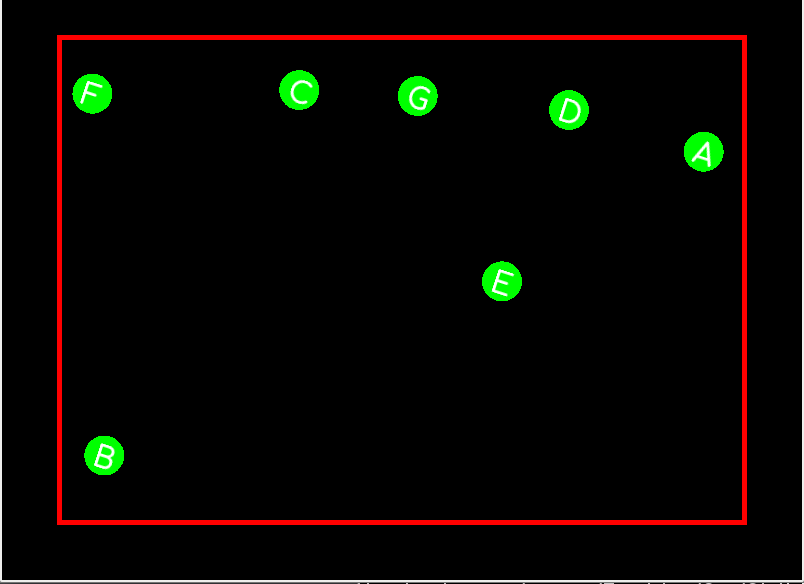

# Odbijajuće kuglice

U  ovom zadatku treba napisati program koji simulira proizvoljan broj kuglica
koje se kreću unutar zadanog krutog okvira.

- Kuglice se inicijalno razmještaju na slučajne lokacije unutar okvira
(pravokutnika) ali tako da se ne presjecaju niti ne dodiruju.
- Kuglicama se u početnom trenutku zadaju proizvoljne brzine (po Gaussovoj
  razdiobi s _nekim_ parametrima).
- Unutar svake kuglice je slovo koje rotira brzinom od 2 stupnja u sekundi. Slova
neka počinju od `A` i svaka sljedeća kuglica  dobiva sljedeće slovo.  
- Kuglice se elastično odbijaju od vanjskog okvira i ne mogu izaći iz njega.
- Kuglice se elastično odbijaju jedna od druge. Pri tome se pretpostavlja da
sve imaju istu masu.
- Nije potrebno promatrati složene situacije višestrukih kolizija. Koliziju s
vanjskim rubom treba kontrolirati zadnju kako kuglice ne bi izašle iz okvira.
- Rješenje se sastoji od dvije klase `Game` i `Ball`. U kodu je predložen i privatni
i javni dio tih klasa no vi ih možete slobodno mijenjati.

*Napomena 1.* Kolizija kuglica se provjerava usporedbom udaljenosti centara
kuglica sa sumom njihovih radijusa. Nije potrebnio egzaktno odrediti trenutak
kolizije već se možete oslanjati na činjenicu da je vremenski korak vrlo mali.

*Napomena 2.* Brzine nakon kolizije se određuju na osnovu zakona
sačuvanja impulsa i zakona sačuvanja kinetičke energije. Potražiti formule
u udžbenicima iz mehanike ili na web-u.

U README.md treba napisati kratko objašnjenje kako je riješen problem kolizija.

