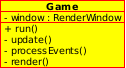
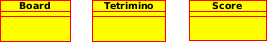
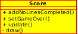
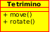
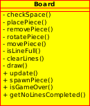
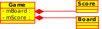
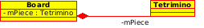

# Tetris

**Zadatak**. Treba implementirati tetris igru.

Zadatak treba riješiti objektno orijentiranom metodom što znači
da se čitav program treba sastojati od nekoliko objekata i komunikacije
među njima. Stoga će prvo trebati odgovoriti na ova pitanja:

- Koliko će biti tipova objekata (klasa) i koliko samih objekata (instanci) u programu?
- Koje su odgovornosti pojedinih objekata?
- Kako se odvija komunikacija među objektima?

## Klase koje čine program

Kako se radi o video igri osnovna klasa će biti `Game` klasa.
Kao i do sada njene su odgovornosti sljedeće:

- Implementira petlju igre;
- Osluškuje događaje i prosljeđuje informacije o njima;
- Aktualizira scenu;
- Iscrtava scenu.

  

U samoj igri javljaju se sljedeći objekti:
- Tabla na kojoj se igra, odnosno mreža unutar koje se igra odvija;
- Komad koji pada;
- Ispis rezultata.

Svaki će od ova tri objekta  biti implementiran u zasebnoj klasi te ćemo imati sljedeće
dodatne klase: `Board` (tabla), `Tertrimino` (komad koji pada) i `Score` (ispis
rezultata).

  

Objekt koji pada možemo pomicati lijevo - desno i rotirati. Kada padne na
dno, odnosno neki drugi objekt, onda staje. Tada ga više ne možemo pomicati i tada ustvari
prestaje biti objekt. U tom trenutku generiramo novi `Tetrimino` objekt na vrhu
mreže.

- U cijelom programu ćemo uvijek imati samo samo po jedan objekt od ove četiri klase.

## Odgovornosti pojedinih klasa

Svaki objekt treba sadržavati sve informacije o sebi i treba nuditi sve
dozvoljene operacije nad sobom. Pri tome treba imati što manje
(ne više nego što je nužno) veza s drugim objektima.

### Klasa `Score`

Kod ove klase situacija je jednostavna. Klasa treba prikazivati
trenutni rezultat igre i na kraju igre string "Game over". Ona ne treba
poznavati niti jedan drugi objekt u igri. Dovoljno je da nudi jednu
metodu `addNoLinesCompleted(n)` koja će preuzeti broj dovršenih linija
`n` i izračunati broj bodova igre. Klasa će akumulirati dovršene linije
i bodove izračunavati po pravilu:

- jedna kompletirana linija daje 10 bodova;
- dvije linije kompletirane istovremeno daju 20 bodova;   
- tri linije kompletirane istovremeno daju 30 bodova;   
- četiri  linije kompletirane istovremeno (to je maksimum) daju 40 bodova.

Druga metoda koju klasa nudi je `setGameOver()` nakon čijeg se poziva
ispisuje "Game over" string.

Objekt klase `Score` mora se još  iscrtavati i aktualizirati (promijeniti broj bodova koji će ispisati).

  

###  Klasa `Tetrimino`

Ova klasa predstavlja dio koji se spušta.

- Postoji 7 komada koji imaju različit oblik i boju;
- Svaki komad se pojavljuje u 4 rotacije.
- Komad pokrećemo lijevo i desno strelicama (`Left` i `Right`), a
rotiramo sa strelicom prema gore (`Up`);
- Komad se može i "spustiti" tako da padne pritiskom na razmaknicu
(`Space`);
- Nakon proteklog vremenskog intervala komad se u mreži spušta za jedno
mjesto niže ako je to moguće. Interval može biti, na primjer, 0.3 sekunde.

U trenutku kada komad dođe do dna ili dodirne drugi komad tako da ne može
ići niže on ostaje zamrznut na tome mjestu. Tada se slučajnim izborom generira novi komad na vrhu mreže te on počinje padati. Komad se uvijek
 generira  po sredini mreže. Kada više nema mjesta za novo generirani
 komad igra je gotova.

 `Tetrimino` treba imati ove podatke:
 - svoj oblik i boju;
 - svoj položaj i rotaciju;
 - vrijeme proteklo od zadnjeg spuštanja.

`Tetrimino` treba znati:
  - pomaknuti se;
  - zarotirati se.

Prije svakog pomaka ili rotacije komada treba provjeriti da li ima mjesta
za tu operaciju. Da bi komad mogao obaviti tu zadaću morao bi poznavati
objekt klase `Board` (da dobije granice mreže). S druge strane, `Board`
mora poznavati komad jer ga treba iscrtati. Stoga je prirodno da objekt klase `Board` pri smještavanju komada na ploču provjeri da li se translacija ili rotacija mogu izvršiti.

Time dolazimo do sljedećeg zaključka:
- Klasa `Tetrimino` ne pozna druge klase te samo manipulira svoje
unutarnje stanje;
- Klasa `Board` će implementirati cjelokupnu logiku igre.

  

### Klasa `Board`

Kako klasa `Board` implementira cijelu logiku igre imat će puno
odgovornosti:

- Konstrukcija mreže;
- Kreiranje početnog tetrimina;
- Aktualizacija ploče;
- iscrtavanje ploče.

Klasa `Board` smješta element na ploču, pomiće ga (lijevo, desno i
prema dolje) i rotira. Prije pomicanja elementa mora provjeriti ima li
dosta mjesta za element jer element ne smije izaći iz granica ploče i
ne smije pasti ispod elemenata koji su već pali. Ista provjera se radi
i prije rotacije. Translacije (lijevo, desno) i rotacije kojima bi
element izašao iz ploče se jednostavno ignoriraju.

Kod pomicanja i rotacije elementa on se prvo obriše, zatim se pomakne
i onda se iscrta. Stoga je potrebna i metoda za brisanje elementa.

Nakon isteka vremenskog perioda element se pomakne za jedno mjesto
niže. Tada se provjerava ima li popunjenih linija i ako ih ima brišu
se. Funkcija brisanja linija mora vratiti broj izbrisanih linija radi
računa bodova.  

Klasa  `Board` bi mogla biti implementirana pomoću sljedećih funkcija:

  

## Komunikacija među objektima

Klasa `Game` u svojoj `update()` metodi mora zvati `update()` metode
na objektima tipa `Board` i  `Score`. Tu je mjesto gdje se može
očitati broj obrisanih linija od objekta  tipa `Board` i predati
objektu tipa `Score`, prije no što se pozove njegova `update()` metoda.

Objekti tipa `Board` i  `Score` imaju životni vijek koji je određen
životnim vijekom objekta tipa `Game`. Oni ne postoje neovisno od
`Game` objekta i uništavaju se kada se uništava `Game` objekt.
Stoga je `Game` objekt *komponiran* od objekata tipa `Board` i
 `Score` i stoga oni mogu biti varijable članice klase  `Game`.

 

  

Slična je situacija između objekta klase `Board` i objekta klase
`Tetrimino`. I tu koristimo kompoziciju kao odnos između klasa.

  

## Implementacijski detalji

Svaki komad (`Tetrimino`) ima pridruženu cjelobrojnu labelu
(koristiti `enum`). Klasa `Board` će pamtiti polje cijelih brojeva
koje čuva *logičku* sliku mreže. U polju u kojem se nalazi neki
tetrimino čuva se njegova labela. Polja koja su prazna imaju neku
vrijednost koja označava prazno polje (na primjer -1).

Sve operacije na mreži vrše se na logičkom prikazu mreže. Tek se u
pozivu metode `draw()` vrši stvarno iscrtavanje pravokutnika
(`sf::RectangleShape`) odgovarajuće boje ovisno o logičkom sadržaju
mreže.

Klasa `Tetrimino` predstavlja svih sedam komada. Za njihov prikaz
ćemo ponovo iskoristiti logički prikaz oblika. Svaki se oblik
 nalazi unutar jednog polja od 4x4 pravokutnika.
Oblik pamtimo *logički* tako što cijeli broj različit od nule znači
da pravokutnik sudjeluje u obliku, a nula da ne sudjeluje. Štoviše,
pamtit ćemo na taj način i sve rotacije oblika tako da nećemo fizički
rotirati oblik već ćemo samo selektirati rotaciju (vidjeti datoteku
  tetrimino.cpp).
