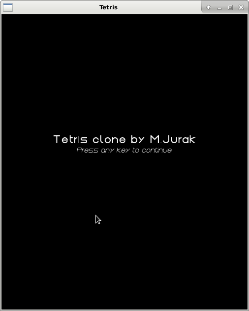
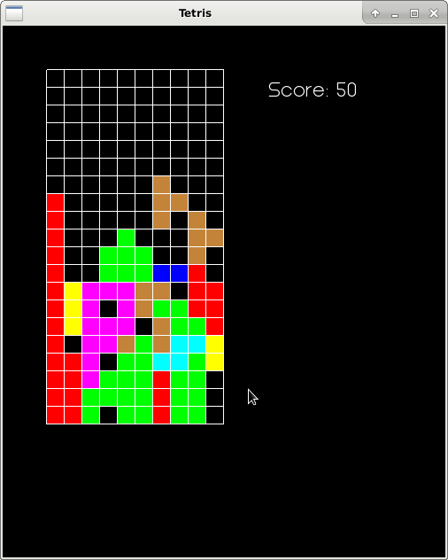
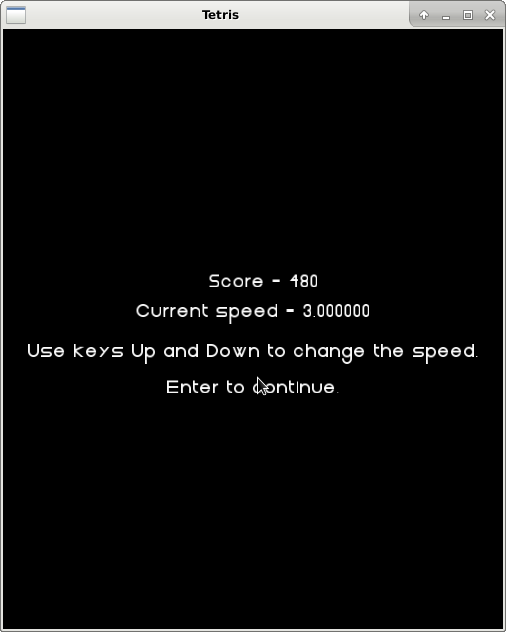
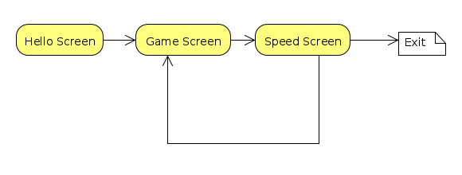
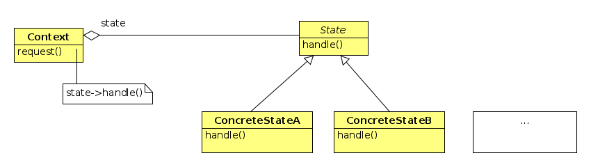
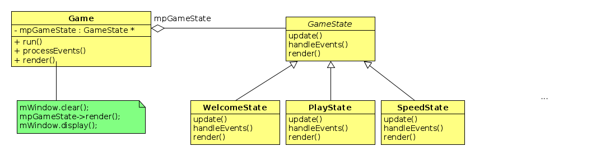

# Tetris sa _stanjima_

U ovom je zadatku potrebno doraditi _Tetris_ igru dodavanjem
pozdravnog ekrana i ekrana za promjenu brzine igre.

Igra započinje pozdravnim ekranom. Na primjer:



(Vi ćete staviti svoje ime na ekran.)
Nakon što se pritisne bilo koja tipka počinje igra.
Igrač dobiva ekran igre:




Kada igra završi ne ispisuje se više _Game Over_ već
se icrtava novi ekran na kojem se
prikazuje postignuti broj bodova i dozvoljava se
promjena brzine igre.



 Na zadnjem ekranu igrač može povećati ili smanjiti
 brzinu igre s tipkama `Up` i `Down` te započeti novu
 igu s `Return`. Igra se prekida klikom na  `x`.

## Konačni automat

Vidmo da naša aplikacija ima niz stanja u kojima se ponaša na različite
načine. U igri mora reagirati na strelice, u ostalim stanjima reagira
 na strelice i `Return` ili na bilo koju tipku. Svako stanje radi drukčije
 iscrtavanje. Iz jednog stanja se može prijeći u  drugo stanje
 prema _pravilima igre_. Takva se struktura naziva _konačni automat_
 i u našem slučaju je vrlo jednostavna i može se prikazati na ovaj način:

 


Različita stanja bismo mogli implementirati tako da u tri metode
`Game` klase:  `handleEvents()`, `update()` i `render()`  imamo
jednu `if` naredbu unutar koje tretiramo svako pojedino stanje.
Takvo se rješenje ne skalira dobro jer vodi na implementaciju
logike različitih stanja na jednom mjestu.

**State** oblikovni obrazac na omogućava da kod koji pripada različitim
stanjima odvojimo u zasebne klase.

**Napomena**: Monolitnu metodu `processEvents()` treba faktorizirati
tako da se dio logike vezane uz sva tri stanja prebaci u novu metodu
`handleEvents()`.

## _State_ oblikovni obrazac

Umjesto da implementiramo logiku različitih stanja u jednoj velikoj if
naredbi stavit ćemo logiku svakog pojedinog stanja u zasebnu klasu. Time dobivamo
sljedeću strukturu:

 

 Ovdje je uvedena apstraktna bazna klasa `State` koja nudi sučelje koje apstrahira
  pojedina stanja. Konkretna stanja su implementirana u zasebnim klasama
 `ConcreteStateA`, `ConcreteStateB` itd. Klasa `Context` sadrži kod koji se mijenja
 prilikom promjene stanja. Ona drži referencu na `State` objekt koja je u svakom trenutku
 inicijalizirana konkretnim stanjem. Dio koda unutar metode `request()` koji ovisi
 o stanju delegira se konkretnom stanju kroz referencu na  `State`. Promjenu stanja
 (prelazak iz jednog stanja u drugo) mogu vršiti sama stanja ili `Context`.

U našem slučaju  `Context` će biti `Game` klasa. Njene funkcije `handleEvents()`
`update()` i `render()` ovise o stanju. Kako metoda `processEvents()` obrađuje i događaje koji ne ovise
o trenutnom stanju to faktoriziramo dio te metode u
`handleEvents()` metodu. Stoga u `State` klasu (koju ćemo nazvati `GameState`)
izdvajamo tri metode: `update()`,  `handleEvents()` i `render()`. Te metode
možemo eventualno maknuti iz `Game`  klase. Metoda `run()`  ih može pozivati kroz pokazivač na
trenutno stanje. Time dolazimo do sljedeće implementacije oblikovnog obrasca:




## Mijenjanje stanja

Ostaje još pitanje tko će mijenjati trenutno stanje u klasi `Game`. U ovom slučaju
to mogu raditi sama _stanja_. Klasa `Game` treba ponuditi metodu

```c++
void setState(GameState::State newState)
```
a sve state-klase trebaju uzeti u svom konstruktoru pokazivač na  `Game`
objekt kako bi mogle postaviti sljedeće stanje igre.
Taj je pokazivač prirodno čuvati u baznoj klasi
`GameState`. Sva stanja trebaju biti alocirana u konstruktoru `Game`
klase.

## Dijeljenje podataka između stanja

Ovaj je obrazac najjednostavniji kada stanja ne moraju
dijeliti podatke. U našem slučaju stanja `PlayState`
i `SpeedState` trebaju dijeliti brzinu igre i
igračev rezultat.

**Napomena**. Brzinu igre definiramo kao 1/dt gdje je
dt vrijeme za koje tetrimino pada za jedan blok.

Budući da sva stanja drže referencu (pokazivač) na klasu
`Game` te dvije varijable možemo smjestiti tamo.  

## Restartanje igre

Nakon svakog povratka iz `SpeedState` u `PlayState` stanje
igru treba restartati (obrisati logički prikaz tabele, rezultat,
gameOver zastavicu i startati igru) za što nam treba posebna metoda `start()` koju do sada nismo imali. Tu metodu dohvaćamo
kroz pointer na baznu klasu i stoga ju moramo staviti
`GameState` klasu. Kako će biti prerađena samo u `PlayState`  klasi dat ćemo joj trivijalnu implementaciju
u baznoj klasi.
