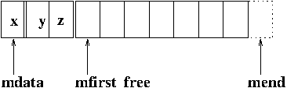
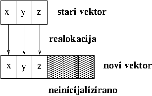

# Vektor s realokacijom

  

Treba implementirati klasu `Vect` tako da dozvoljava metodu `push_back` i realokaciju vektora kada 
nema mjesta za novi element.  Vektor će imati 3 pokazivača: `mdata` - pokazivač na prvi element polja;
`mfirst_free` - pokazivač na prvi slobodni element u polju i `mend` - pokazivač na jedno mjesto iza zadnjeg 
elementa u polju.

Kada nema dovoljno prostora da smjestimo još jedan element vršimo realokaciju. Realociranom vektoru
ćemo dati dvostruku duljinu trenutnog vektora (da ne realociramo suviše često). Pri realokaciji stoga jedan 
dio prostora ispunjavamo starim elementima, a drugi ostavljamo __neinicijaliziranim__. To je zadatak za **alokator**.

**Napomena**: Budući da funkcija `realocate` koristi alokator i svo ostalo alociranje (i dealociranje)
memorije mora ići preko alokatora. To znači da konstruktor, konstruktor kopije i operator pridruživanja moraju 
alocirati memoriju pomoću 
alokatora (alokacija i dealokacija moraju biti  __usklađene__). 

Klasa `Vect` mora držati jedan alokator (`std::allocator<double>`) koji ćemo 
implementirati kao **statičku varijablu**. 
Sva se alokacija i  dealokacija  dešava pomoću tog alokatora. Implementacijska odluka je da 
se dealokacija zatvori u jednu rutinu `free()`
koja se može koristiti u destruktoru, operatorima pridruživanja i `reallocate()` funkciji.

## Sučelje klase

Sučelje klase (**Vect.h**) i određeni implementacijski detalji su dani ovdje. Klasa mora imati:

* Konstruktor koji uzima dimenziju vektora i inicijalizacijsku vrijednost. Oba argumenta moraju imati 
   defaultne parametre.
* Konstruktor bez parametara konstruira prazan vektor.
* Konstruktor kopije kopiranjem i premještanjem.
* Operator pridruživanja kopiranjem i premještanjem.
* Destruktor.
* Operatore dohvata ([]), konstantan i nekonstantan.
* `push_back` metodu.
* Metode `size()` i `capacity()` (kao `std::vector`)
* Operatore `+=` i `-=`.
* Operator `*=` koji množi sve komponente vektora sa danom konstantom.
* Metodu `two_norm()` koja računa euklidsku normu vektora. Metoda na praznom vektoru mora vratiti 0.

Izvan klase moraju biti definirani operatori zbrajanja i oduzimanja vektora. 
Konačno treba konstruirati operator ispisa na izlazni stream koji ispisuje vektor u 
obliku `[1,2,3]` (za vektor s komponentama 1,2,3). Prazan vektor treba ispisati kao `[]`. 
U ispis ne ubacivati bjeline ili znak za prijelaz u novi red.

Program se mora sastojati od tri datoteke: **main.cpp**, **vect.h** i **vect_impl.h**.
Implementacija metoda ide u datoteku **vect_impl.h** koja se uključuje u **vect.h**. 

## Alokatori -- osnovno što treba znati

-  Operator `new` kombinira alokaciju memorije i konstrukciju objekta u njoj.</li>
-  Operator `delete` kombinira destrukciju objekta i dealokaciju memorije,</li>

Alokatori iz zaglavlja `<memory>` nam omogućavaju da razdvojimo fazu alokacije 
memorije od konstrukcije objekta u memoriji  te, isto tako fazu destrukcije objekta i dealokaciju 
memorije.

To je posebno važno kod klasa kao što je `std::vector<T>` koje alociraju više memorije no što 
drže elemenata. Bez alokatora sva bi memorija morala biti konstruirana (defaultnim konstruktorom).

| **Poziv**              |  **Značenje** |
| -----------------------|  ------------ |
| `allocator<T> a`       |  Definira alokator `a` koji alocira memoriju za tip `T.`  |
| `a.allocate(n)`        | Alocira neinicijaliziranu memoriju za `n` objekata tip `T`. Vraća pokazivač na alociranu memoriju. |
| `a.deallocate(p,n)`    | Dealocira memoriju koja sadrži `n` objekata tip `T` na koju pokazuje pokazivač `p`.  Pokazivač `p` mora biti dobiven od `allocate`, a `n` mora biti korišten u pozivu metode `allocate`. Objekti koji su eventualno konstruirani u toj memoriji moraju biti uništeni metodom `destroy()` prije poziva `deallocate`.|
| `a.construct(p, args)` | `p` mora biti pokazivač tipa `T` na neinicijaliziranu memoriju; `args` su argumenti za konstruktor tipa `T` koji se koriste da bi se na mjestu na koje pokazuje `p` konstruirao objekt tipa `T`. |
| `a.destroy(p)`         | `p` mora biti pokazivač tipa `T`. Poziva destruktor na objektu na koji pokazuje `p`.  Objekt mora prije toga biti konstruiran na tom mjestu. |

Korisne mogu biti još dvije metode iz `memory` zaglavlja;

| **Poziv**                    | **Značenje** |
| ---------                    |  ----------- |
| `uninitialized_copy(b,e,b2)` | Kopira elemente iz raspona danog s iteratorima `b` i `e` u neinicijaliziranu memoriju na koju pokazuje `b2`, koji mora       pokazivati na dovoljnu količinu memorije. |
|  `uninitialized_fill(b,e,t)` | Konstruira objekte u neinicijaliziranoj memoriji omeđenoj s iteratorima `b` i `e` kopirajući element `t`.|

Postoje i **copy_n** i **fill_n** verzije tih funkcija koje uzimaju polazni iterator i broj elemenata.

